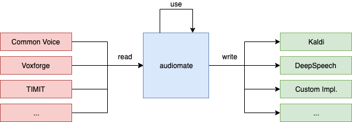

# Summary
Machine Learning has a variety of applications in different fields,
including audio-related tasks. But especially with deep learning the need for data has been increased dramatically.
Therefore data has to be prepared carefully before the actual problem can be tackled.
Audiomate aims to reduce the effort for preparation of audio datasets,
by providing a universal interface for them.

The main concept of audiomate can be defined by three blocks as illustrated in Figure 1.
It consists of a reading-block, a usage-block, and a writing-block.

The reading-block is responsible to read datasets from dataset-specific formats to a universal structure.
To do so audiomate implements a reader for various publicly available datasets.
Without knowing details about the structure of the data,
one can load the data by just providing a path to the downloaded data and defining the type of the dataset.
For some datasets, downloaders are implemented, which take care of downloading the data.
Furthermore, known errors in the datasets (e.g. empty audio files) are ignored automatically.

The usage-block provides various functionality to access, analyze and manipulate the data.

* Access all meta-data, like speakers, labels
* Read audio data
* Retrieve information about the data (e.g. amount of speakers, total duration, ...)
* Merge data of multiple datasets (e.g. Combine two speech datasets)
* Split data into smaller subsets (e.g. Create train/dev/test splits with a reasonable distribution of classes)
* Validate data for specific requirements (e.g Check if all samples have assigned a label)

The writing-block is finally used to save the data again.
In the same way, specific readers are implemented, audiomate provides specific writers.
The writer takes the universal structure and stores the data in a specific format.
A writer is intended to store data in a format that is understandable by a third-party framework.
For example, in speech recognition, the Kaldi-Writer can be used to store data
in a format that is readable with the Kaldi-Toolkit [@Povey2011TheKS].

Apart from third-party formats, there is an audiomate-specific format as well.
This is intended to store data, that is used with audiomate at some other point.

# Acknowledgements
Parts of audiomate were developed during the project Keyword Spider (KWS) funded by INNOSUISSE (26567.1 PFES-ES).

# References
